<h1></h1>

[mega 제품군](https://codeblack-inc.github.io/mega-bi/) · [브랜드 가이드와 로고](https://github.com/Codeblack-Inc/mega-bi) · [mega-ppt](https://github.com/Codeblack-Inc/mega-ppt) · [원본 diagram-design](https://github.com/cathrynlavery/diagram-design)

한국어 문서에 바로 넣는 다이어그램을 만드는 Claude Code / Codex 플러그인.

mega-diagram은 [Cathryn Lavery](https://github.com/cathrynlavery)의 [diagram-design](https://github.com/cathrynlavery/diagram-design)(MIT)을 기반으로 한 한국형 포크다. 편집 원칙, 41가지 형식, 연결선 규칙, 검증 스크립트는 원본을 그대로 쓰고, 색·한글·배경을 한국 문서에 맞게 바꿨다. 자세한 출처는 [아래](#출처와-라이선스)에 있다.

[](docs/ko/architecture.png)

*[docs/ko/architecture.html](docs/ko/architecture.html) — 한글 라벨은 Pretendard, 기술 부제는 Geist Mono, 강조는 mega-diagram 블루 한 곳.*

## 원본과 다른 점

| | diagram-design | mega-diagram |
|---|---|---|
| **색** | 흰연기색 종이, 주황 강조 | [mega BI](https://github.com/Codeblack-Inc/mega-bi) 잉크·페이퍼·뮤티드, 강조는 블루 `#2F6FDB`, 외부 호출은 mega 바이올렛 |
| **한글** | Noto Sans KR 대체 글꼴 | **Pretendard**(mega-ppt·mega-ui와 같은 서체), 한국어 요청이면 라벨도 한국어, 명사형·개조식 규칙 |
| **배경** | SVG 안에 종이색 사각형 | **배경 없음** — 내보낸 SVG/PNG가 투명해서 HWP·Word·PPT 위에 그대로 얹힌다 |
| **종이색** | 따뜻한 회색 `#F5F5F5` | 흰색 `#FFFFFF` — 라벨 마스크가 흰 문서에서 보이지 않는다 |
| **문서 프리셋** | 블로그·슬라이드 크기 | A4 본문, 흑백 인쇄, mega-ppt 패널 프리셋과 배율 |
| **연동** | — | mega-ppt `image` 패널, HWP·Word 삽입 방법 |

규칙은 [`skills/mega-diagram/references/mega.md`](skills/mega-diagram/references/mega.md)에 모았다.

## 만드는 것

41가지 형식, 형식마다 밝은·어두운·에디토리얼 세 가지 변형. 갤러리는 [`skills/mega-diagram/assets/index.html`](skills/mega-diagram/assets/index.html)을 브라우저로 열면 된다.

<table>
<tr>
  <td align="center" width="33%"><a href="docs/screenshots/architecture.png">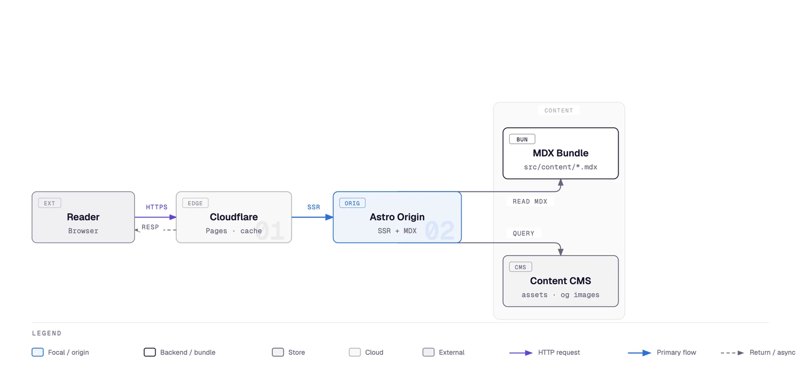</a><br><b>구성도</b> <sub>Architecture</sub><br><sub>구성 요소와 연결</sub></td>
  <td align="center" width="33%"><a href="docs/screenshots/it-state.png">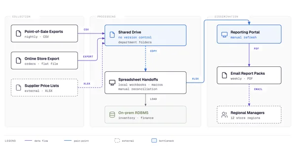</a><br><b>IT 현황도</b> <sub>IT current-state</sub><br><sub>레거시 현황과 전환</sub></td>
  <td align="center" width="33%"><a href="docs/screenshots/flowchart.png">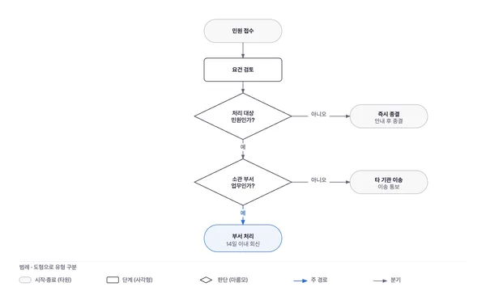</a><br><b>흐름도</b> <sub>Flowchart</sub><br><sub>판단과 분기</sub></td>
</tr>
<tr>
  <td align="center" width="33%"><a href="docs/screenshots/sequence.png">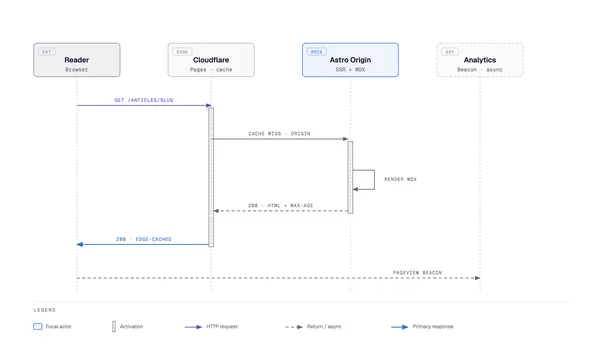</a><br><b>시퀀스</b> <sub>Sequence</sub><br><sub>시간순 메시지</sub></td>
  <td align="center" width="33%"><a href="docs/screenshots/state.png">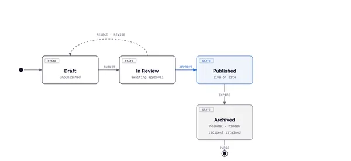</a><br><b>상태 전이도</b> <sub>State machine</sub><br><sub>상태와 전이</sub></td>
  <td align="center" width="33%"><a href="docs/screenshots/er.png">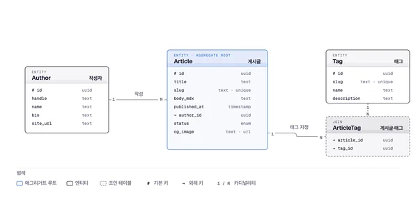</a><br><b>ER 모델</b> <sub>ER / data model</sub><br><sub>엔터티와 필드</sub></td>
</tr>
<tr>
  <td align="center" width="33%"><a href="docs/screenshots/timeline.png">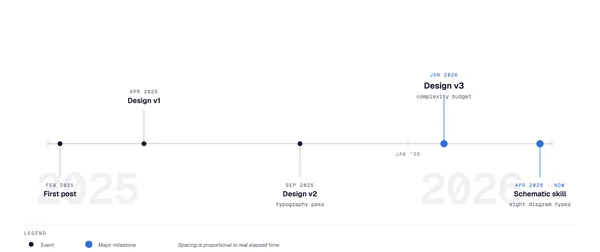</a><br><b>타임라인</b> <sub>Timeline</sub><br><sub>시간 축 위의 사건</sub></td>
  <td align="center" width="33%"><a href="docs/screenshots/swimlane.png">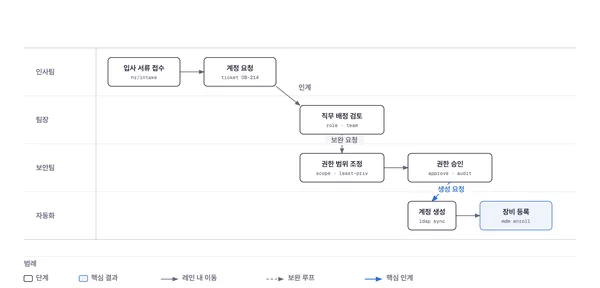</a><br><b>스윔레인</b> <sub>Swimlane</sub><br><sub>부서 간 업무 흐름</sub></td>
  <td align="center" width="33%"><a href="docs/screenshots/quadrant.png">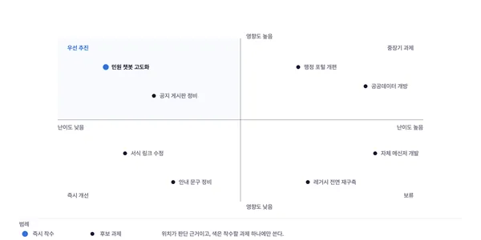</a><br><b>4분면</b> <sub>Quadrant</sub><br><sub>두 축 포지셔닝</sub></td>
</tr>
<tr>
  <td align="center" width="33%"><a href="docs/screenshots/radar.png">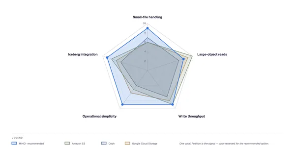</a><br><b>레이더</b> <sub>Radar / spider</sub><br><sub>다축 비교</sub></td>
  <td align="center" width="33%"><a href="docs/screenshots/loop.png">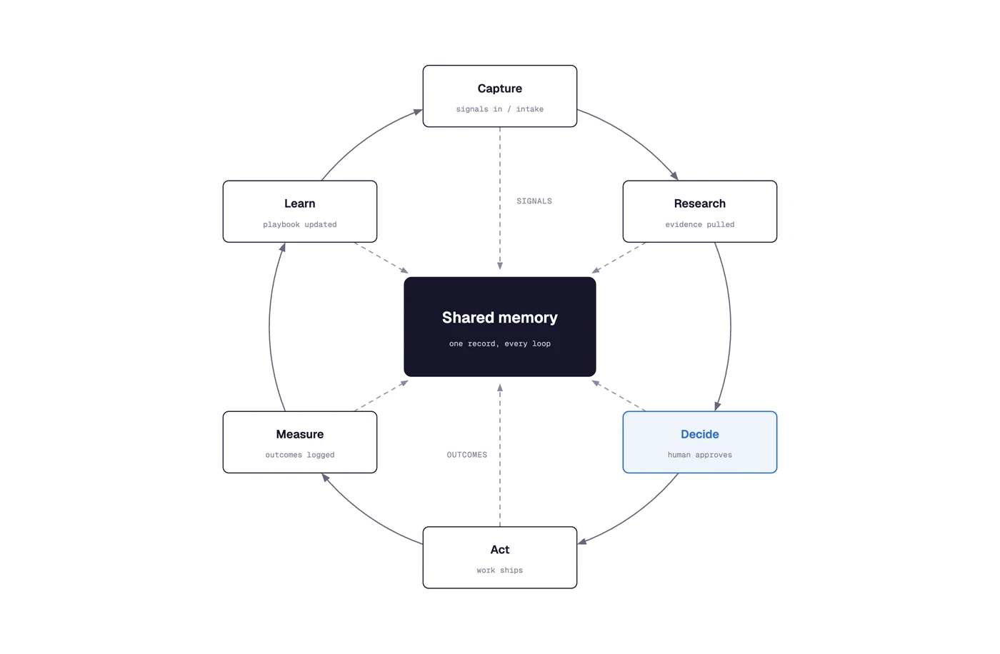</a><br><b>순환 구조</b> <sub>Loop / flywheel</sub><br><sub>강화 루프와 공유 허브</sub></td>
  <td align="center" width="33%"><a href="docs/screenshots/nested.png">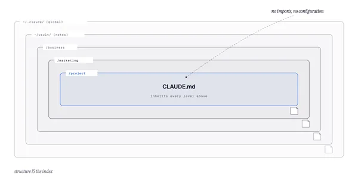</a><br><b>포함 관계</b> <sub>Nested</sub><br><sub>범위로 표현한 계층</sub></td>
</tr>
<tr>
  <td align="center" width="33%"><a href="docs/screenshots/tree.png">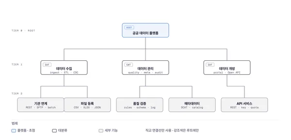</a><br><b>트리</b> <sub>Tree</sub><br><sub>상위 → 하위</sub></td>
  <td align="center" width="33%"><a href="docs/screenshots/org-chart.png">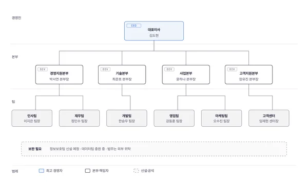</a><br><b>조직도</b> <sub>Org chart</sub><br><sub>소유와 보고 체계</sub></td>
  <td align="center" width="33%"><a href="docs/screenshots/layers.png">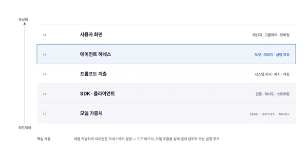</a><br><b>계층 구조</b> <sub>Layer stack</sub><br><sub>쌓인 추상 계층</sub></td>
</tr>
<tr>
  <td align="center" width="33%"><a href="docs/screenshots/venn.png">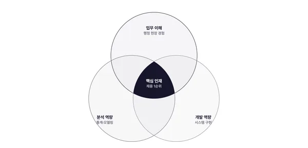</a><br><b>벤 다이어그램</b> <sub>Venn</sub><br><sub>집합의 겹침</sub></td>
  <td align="center" width="33%"><a href="docs/screenshots/pyramid.png">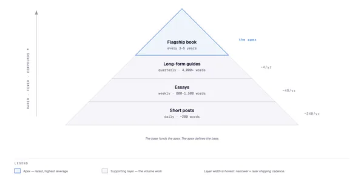</a><br><b>피라미드·퍼널</b> <sub>Pyramid / funnel</sub><br><sub>위계와 이탈</sub></td>
  <td align="center" width="33%"><a href="docs/screenshots/bar.png">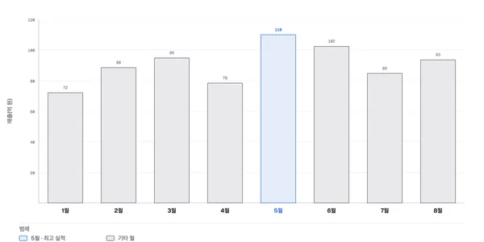</a><br><b>막대 차트</b> <sub>Bar chart</sub><br><sub>항목별 비교</sub></td>
</tr>
<tr>
  <td align="center" width="33%"><a href="docs/screenshots/treemap.png">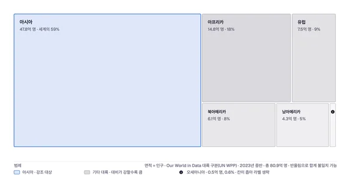</a><br><b>트리맵</b> <sub>Treemap</sub><br><sub>면적으로 본 비중</sub></td>
  <td align="center" width="33%"><a href="docs/screenshots/line.png">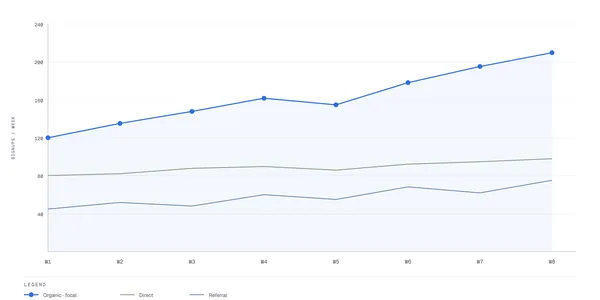</a><br><b>선 차트</b> <sub>Line chart</sub><br><sub>시간에 따른 추세</sub></td>
  <td align="center" width="33%"><a href="docs/screenshots/gantt.png">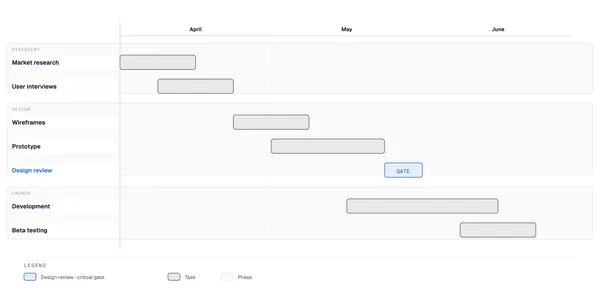</a><br><b>간트</b> <sub>Gantt</sub><br><sub>일정과 단계</sub></td>
</tr>
<tr>
  <td align="center" width="33%"><a href="docs/screenshots/scatter.png">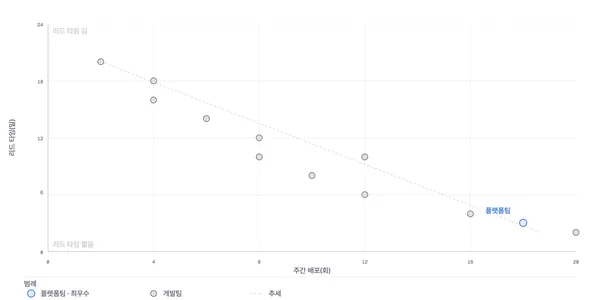</a><br><b>산점도</b> <sub>Scatter plot</sub><br><sub>분포와 상관</sub></td>
  <td align="center" width="33%"><a href="docs/screenshots/high-level.png">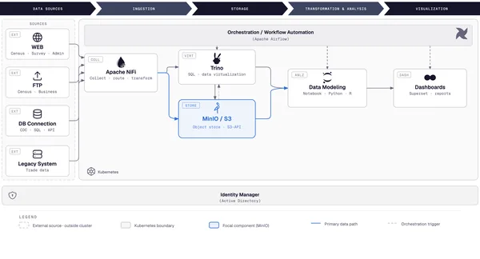</a><br><b>전체 구성도</b> <sub>High-Level</sub><br><sub>클러스터 위 전체 스택</sub></td>
  <td align="center" width="33%"><a href="docs/screenshots/process.png">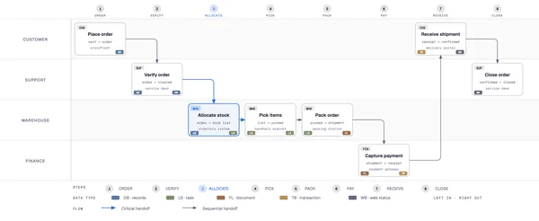</a><br><b>프로세스</b> <sub>Process</sub><br><sub>여러 주체의 순차 업무</sub></td>
</tr>
<tr>
  <td align="center" width="33%"><a href="docs/screenshots/medallion.png">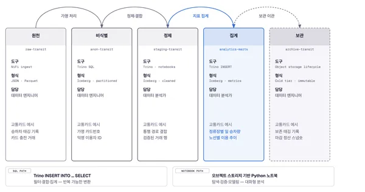</a><br><b>메달리온</b> <sub>Medallion</sub><br><sub>다계층 데이터 저장</sub></td>
  <td align="center" width="33%"><a href="docs/screenshots/data-flow.png">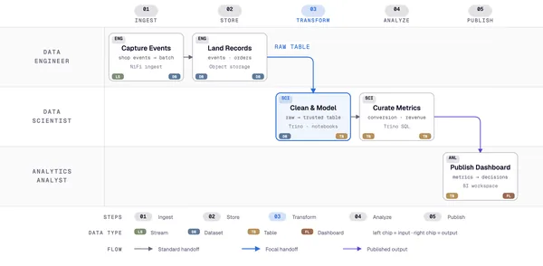</a><br><b>데이터 흐름</b> <sub>Data flow</sub><br><sub>역할별 파이프라인 단계</sub></td>
  <td align="center" width="33%"><a href="docs/screenshots/dp-integration.png">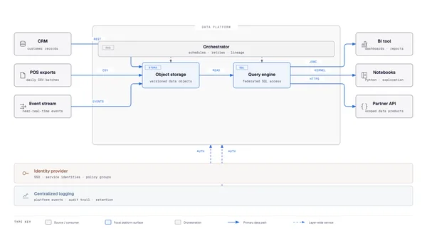</a><br><b>데이터 플랫폼 연계</b> <sub>DP integration</sub><br><sub>원천 → 코어 → 활용</sub></td>
</tr>
<tr>
  <td align="center" width="33%"><a href="docs/screenshots/dp-security-matrix.png">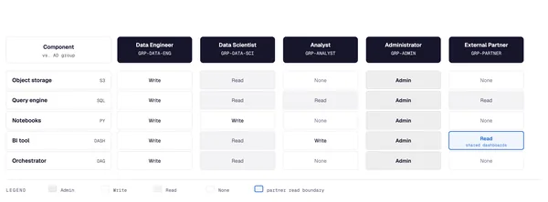</a><br><b>권한 매트릭스</b> <sub>DP security matrix</sub><br><sub>역할별 접근 권한</sub></td>
  <td align="center" width="33%"><a href="docs/screenshots/sankey.png">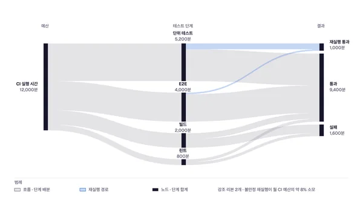</a><br><b>생키</b> <sub>Sankey</sub><br><sub>나뉘고 합쳐지는 양</sub></td>
  <td align="center" width="33%"><a href="docs/screenshots/fishbone.png">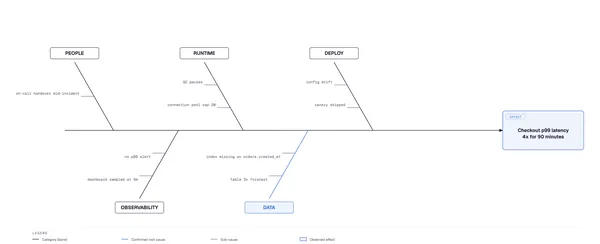</a><br><b>피시본</b> <sub>Fishbone</sub><br><sub>원인 → 결과</sub></td>
</tr>
<tr>
  <td align="center" width="33%"><a href="docs/screenshots/wardley.png">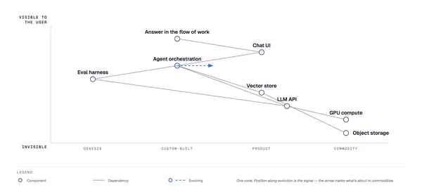</a><br><b>워들리 맵</b> <sub>Wardley map</sub><br><sub>가치사슬 × 진화</sub></td>
  <td align="center" width="33%"><a href="docs/screenshots/kanban.png">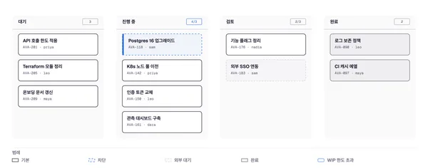</a><br><b>칸반</b> <sub>Kanban</sub><br><sub>상태별 진행 업무</sub></td>
  <td align="center" width="33%"><a href="docs/screenshots/journey.png">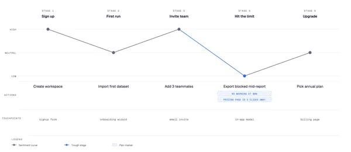</a><br><b>사용자 여정</b> <sub>User journey</sub><br><sub>단계·행동·감정</sub></td>
</tr>
<tr>
  <td align="center" width="33%"><a href="docs/screenshots/deployment.png">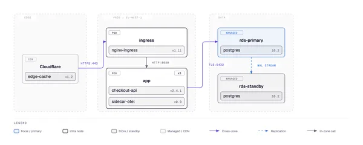</a><br><b>배포도</b> <sub>Deployment</sub><br><sub>영역·호스트·산출물</sub></td>
  <td align="center" width="33%"><a href="docs/screenshots/dependency.png">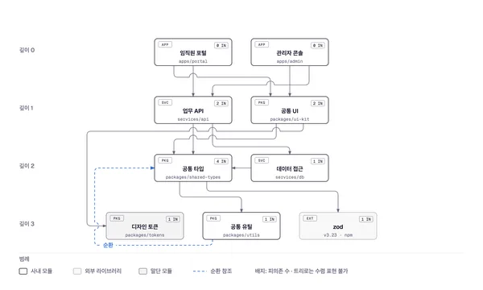</a><br><b>의존성 그래프</b> <sub>Dependency graph</sub><br><sub>팬인·순위·순환</sub></td>
  <td align="center" width="33%"><a href="docs/screenshots/uml-class.png">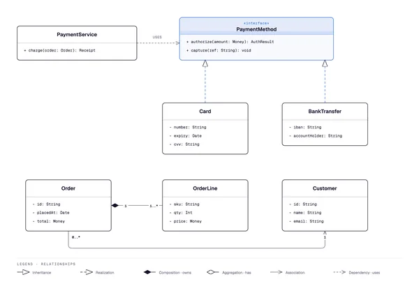</a><br><b>UML 클래스</b> <sub>UML class</sub><br><sub>클래스와 관계</sub></td>
</tr>
<tr>
  <td align="center" width="33%"><a href="docs/screenshots/story-map.png">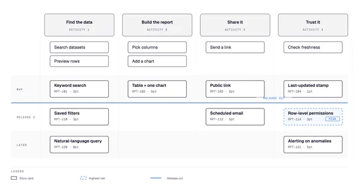</a><br><b>스토리 맵</b> <sub>Story map</sub><br><sub>백본 × 릴리스</sub></td>
  <td align="center" width="33%"><a href="docs/screenshots/db-schema.png">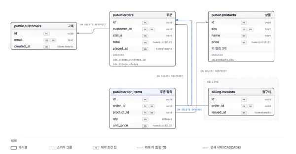</a><br><b>DB 스키마</b> <sub>Database schema</sub><br><sub>물리 테이블과 FK</sub></td>
  <td align="center" width="33%"><a href="docs/screenshots/polar.png">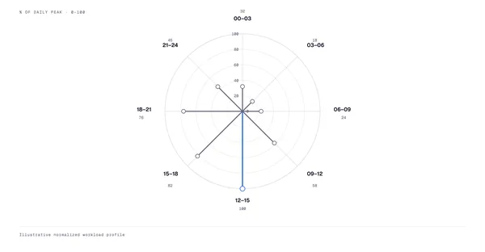</a><br><b>극좌표 차트</b> <sub>Polar chart</sub><br><sub>순환 범주의 크기</sub></td>
</tr>
<tr>
  <td align="center" width="33%"><a href="docs/screenshots/waterfall.png">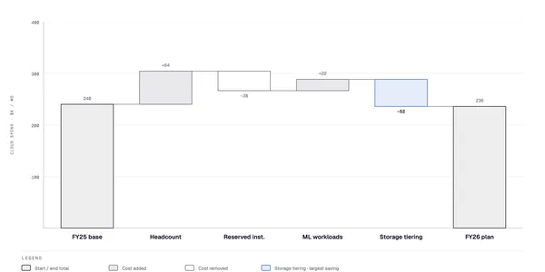</a><br><b>폭포 차트</b> <sub>Waterfall</sub><br><sub>누계와 증감</sub></td>
  <td align="center" width="33%"><a href="docs/screenshots/heatmap.png">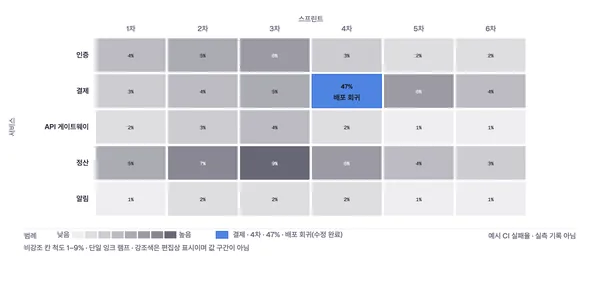</a><br><b>히트맵</b> <sub>Heatmap</sub><br><sub>칸 색으로 본 교차 값</sub></td>
  <td align="center" width="33%"></td>
</tr>
</table>

## 설치

**Claude Code**
```text
/plugin marketplace add Codeblack-Inc/mega-diagram
/plugin install mega-diagram@mega-diagram
```

**Codex**
```bash
codex plugin marketplace add Codeblack-Inc/mega-diagram
codex plugin add mega-diagram@mega-diagram
```

**GitHub Copilot**
```bash
copilot plugin marketplace add Codeblack-Inc/mega-diagram
copilot plugin install mega-diagram@mega-diagram
```

**Factory Droid**
```bash
droid plugin marketplace add https://github.com/Codeblack-Inc/mega-diagram
droid plugin install mega-diagram@mega-diagram --scope user
```

**로컬 개발(심볼릭 링크)**
```bash
ln -s "$PWD/skills/mega-diagram" ~/.claude/skills/mega-diagram
ln -s "$PWD/skills/mega-diagram" ~/.codex/skills/mega-diagram
```

PNG 내보내기에는 Playwright가 필요하다(`pip install playwright && playwright install chromium`). 권장 폰트는 Pretendard.

## 사용

> 우리 서비스 구성도 그려줘. HWP 보고서에 넣을 거야.

> 이 결재 절차를 흐름도로 만들고 PNG로 내보내줘.

> 이 Mermaid 다이어그램을 한글 라벨로 다시 그려줘.

draw.io, Mermaid, Excalidraw 파일은 좌표를 버리고 내용만 가져와 다시 그린다(`/mega-diagram:import-drawio` 등). 무엇을 합치고 뺐는지 목록으로 알려 준다.

[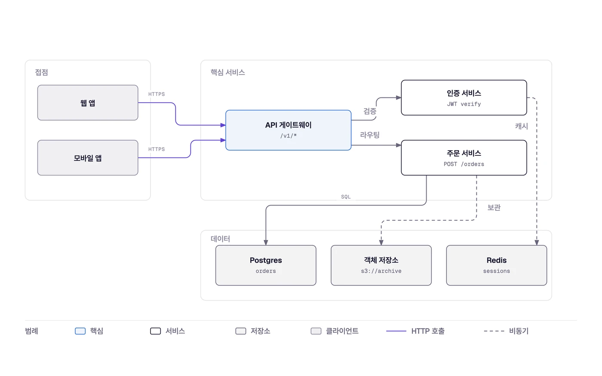](docs/screenshots/import-drawio.png)

에이전트는 형식·크기·스킨을 먼저 한 줄로 알려 주고, HTML을 만든 뒤 요청하면 PNG/SVG로 내보낸다. 목적지별 선택은 이렇다.

| 목적지 | 크기 | 스킨 | 내보내기 |
|---|---|---|---|
| HWP·Word A4 본문 | `doc-inline` | `mega` | PNG ×2 |
| 흑백 인쇄 보고서 | `doc-inline` | `mono` | PNG ×3 |
| mega-ppt 장표 | 패널 비율에 맞춤 | `mega-ppt` | PNG ×2 |
| 위키·README | `doc-wide` | `mega` | SVG 또는 PNG |

## mega 제품군과 함께 쓰기

- **[mega-ppt](https://github.com/Codeblack-Inc/mega-ppt)** — 내보낸 PNG를 `image` 패널에 `"fit": "contain", "border": false`로 넣는다. `mega-ppt` 스킨은 장표와 같은 진한 coral `#B5452D`를 강조색으로 쓴다.
- **HWP·Word** — 투명 PNG를 그림으로 삽입한다. 그림 번호와 캡션은 문서 쪽에서 붙인다.
- **[mega-ui](https://github.com/Codeblack-Inc/mega-ui)** — 인라인 SVG를 그대로 쓴다. 색 토큰이 같다.

## 구조

```
mega-diagram/
├── .agents/plugins/marketplace.json — Codex marketplace catalog
├── .claude-plugin/                  — Claude marketplace + plugin manifest
├── .codex-plugin/                   — Codex plugin manifest
├── .factory-plugin/                 — Factory Droid marketplace + plugin manifest
├── commands/
│   ├── export-diagram.md            — plugin export command
│   ├── import-drawio.md             — plugin draw.io import command
│   ├── import-mermaid.md            — plugin Mermaid import command
│   ├── import-excalidraw.md         — plugin Excalidraw import command
│   ├── profile.md                   — plugin client-profile command
│   └── doctor.md                    — plugin environment diagnostics command
├── prompts/
│   ├── export-diagram.md            — Pi `/export-diagram` prompt template
│   ├── import-mermaid.md            — Pi Mermaid import prompt template
│   ├── import-excalidraw.md         — Pi Excalidraw import prompt template
│   ├── profile.md                   — Pi `/profile` prompt template
│   └── doctor.md                    — Pi `/doctor` diagnostics prompt template
├── skills/
│   └── mega-diagram/
│       ├── SKILL.md                 — philosophy, selection guide, checklist
│       ├── references/              — loaded only when a type or primitive is chosen
│       │   ├── style-guide.md       — single source of truth for colors + fonts
│       │   ├── mega.md              — 한국어 라벨·문서 프리셋·mega 연동 규칙
│       │   ├── semantic-patterns.md — behavior patterns independent of layout
│       │   ├── animation.md         — optional motion + accessibility contract
│       │   ├── onboarding.md        — the URL-to-tokens flow
│       │   ├── profiles.md          — named client profiles + project markers
│       │   ├── import-drawio.md     — draw.io redraw procedure
│       │   ├── import-mermaid.md    — Mermaid redraw procedure
│       │   ├── import-excalidraw.md — Excalidraw redraw procedure
│       │   ├── output-spec.md       — format × size × detail level
│       │   ├── export.md            — SVG / PNG export + sizing
│       │   ├── export-registry.md   — block-metadata JSON sidecar export
│       │   ├── type-architecture.md
│       │   ├── type-flowchart.md
│       │   ├── type-sequence.md
│       │   ├── type-state.md
│       │   ├── type-er.md
│       │   ├── type-timeline.md
│       │   ├── type-swimlane.md
│       │   ├── type-quadrant.md
│       │   ├── type-nested.md
│       │   ├── type-tree.md
│       │   ├── type-org-chart.md
│       │   ├── type-layers.md
│       │   ├── type-venn.md
│       │   ├── type-pyramid.md
│       │   ├── type-sankey.md
│       │   ├── type-fishbone.md
│       │   ├── type-wardley.md
│       │   ├── type-kanban.md
│       │   ├── type-journey.md
│       │   ├── type-deployment.md
│       │   ├── type-dependency.md
│       │   ├── type-uml-class.md
│       │   ├── type-story-map.md
│       │   ├── type-db-schema.md
│       │   ├── primitive-annotation.md
│       │   ├── primitive-sketchy.md
│       │   └── primitive-terminal.md
│       ├── scripts/
│       │   ├── drawio_extract.py    — draw.io → structured IR
│       │   ├── mermaid_extract.py   — Mermaid → structured IR
│       │   ├── excalidraw_extract.py — Excalidraw → structured IR
│       │   └── self_check.py        — packaged output self-check (runs installed)
│       └── assets/
│           ├── index.html           — live gallery, tabbed
│           ├── template*.html       — scaffolds for new diagrams
│           ├── example-<type>.html  — 3 variants per type
│           ├── example-loop-terminal.html
│           ├── example-quadrant-consultant.html
│           ├── example-import-drawio.html
│           ├── example-import-mermaid.html
│           ├── example-import-excalidraw.html
│           ├── example-policy-trace-animated.html
│           └── example-sequence-oauth*.html
├── scripts/
│   ├── build-readme-thumbs.py       — regenerates docs/screenshots/thumbs/
│   ├── bump-plugin-version.py       — synchronized Claude/Codex/Factory version bump
│   ├── render-canonical-screenshots.py — deterministic per-type PNG catalog renderer
│   ├── verify-screenshot-freshness.py — source + screenshot digest gate
│   ├── verify-plugin-package.py     — version + marketplace package gate
│   ├── test-plugin-package.py       — adversarial package-gate tests
│   ├── lint-render.py               — Chromium rendered-layout checker
│   ├── verify-doctor.py             — doctor diagnostics contract gate
│   ├── test-verify-doctor.py        — doctor diagnostics adversarial tests
│   ├── verify-polar.py              — quantitative polar encoding gate
│   ├── test-verify-polar.py         — polar gate adversarial tests
│   ├── verify-sankey.py             — Sankey conservation + geometry gate
│   ├── test-verify-sankey.py        — Sankey gate adversarial tests
│   ├── verify-waterfall.py          — waterfall running-total + bridge gate
│   ├── test-verify-waterfall.py     — waterfall gate adversarial tests
│   ├── test-verify-docs-sync.py     — docs/routing-surface gate tests
│   └── fixtures/
│       ├── sample-flowchart.mmd
│       ├── sample-readme-with-mermaid.md
│       ├── sample-adversarial.mmd
│       ├── sample-whiteboard.excalidraw
│       └── sample-adversarial.excalidraw
├── docs/brand/                      — mega-diagram 로고·심벌·소셜 이미지
├── docs/ko/                         — 한국어 예시 (architecture.html)
├── docs/cookbook.md                 — operator recipes for editable installs and common tasks
├── docs/adr/                        — short records of settled design decisions
├── docs/screenshots/                — full-resolution images + source-digest manifest.json
└── docs/screenshots/thumbs/         — generated WebP previews the README renders
```

원본의 점진적 로딩 구조를 그대로 따른다. `SKILL.md`가 형식을 고르고, 해당 형식의 참조 문서만 읽는다.

## 개발

```bash
python3 scripts/verify-docs-sync.py             # 문서·링크·매니페스트 동기화
python3 scripts/lint-skin.py --all --baseline   # 예제 색·서체가 style-guide 토큰인지
python3 scripts/verify-geometry.py --all        # 연결선 라벨과 노드 겹침
python3 skills/mega-diagram/scripts/self_check.py <파일.html>
for t in scripts/test-*.py; do python3 "$t"; done
```

스크린샷을 다시 만들 때(설치된 Chrome 사용):

```bash
PLAYWRIGHT_CHANNEL=chrome uv run --with playwright python scripts/render-canonical-screenshots.py
uv run --with pillow python scripts/build-readme-thumbs.py
```

## 출처와 라이선스

mega-diagram은 **[diagram-design](https://github.com/cathrynlavery/diagram-design) by [Cathryn Lavery](https://github.com/cathrynlavery)** (MIT, © 2025)의 포크다. v2.6.33(커밋 `dc1ace4`, 2026-09-19)을 가져와 이름을 바꾸고 다음을 고쳤다.

- 기본 스킨을 mega 팔레트로 바꾸고, 174개 예제를 새 토큰으로 다시 칠함
- SVG 안의 전면 배경 사각형을 없애 내보내기를 투명하게 함
- 한글을 Pretendard로 그리도록 템플릿과 안전 검사(`self_check.py`, `lint-skin.py`)에 고정 URL 하나를 허용
- 한국어 문서 규칙 [`references/mega.md`](skills/mega-diagram/references/mega.md) 추가
- 매니페스트·README·로고를 mega 제품군 형식으로 교체

원본의 편집 철학, 형식별 참조 문서, 검증 스크립트, ADR은 원저작자의 작업이다. 두 저작권 표시는 [LICENSE](LICENSE)에, 번들된 아이콘·서체 라이선스는 [THIRD_PARTY_LICENSES.md](THIRD_PARTY_LICENSES.md)에 있다.

MIT
